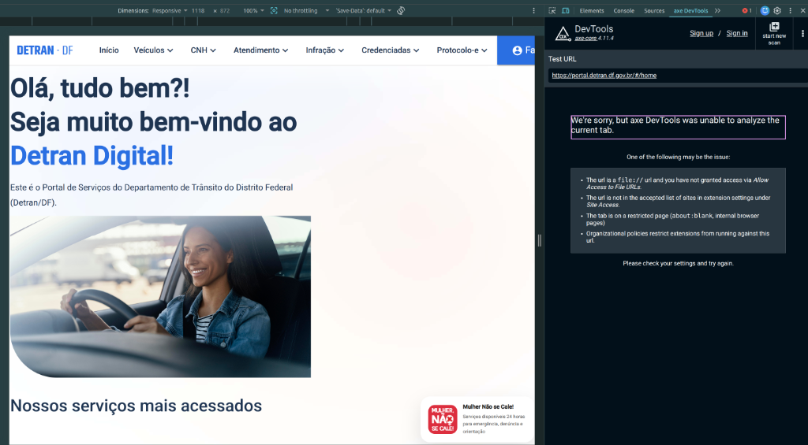
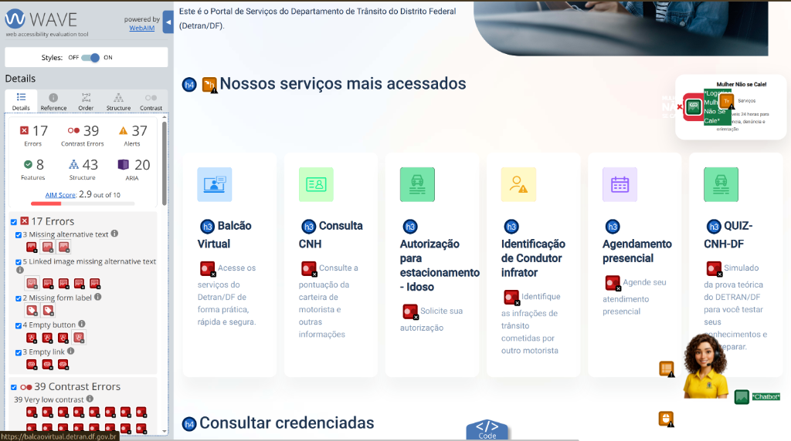
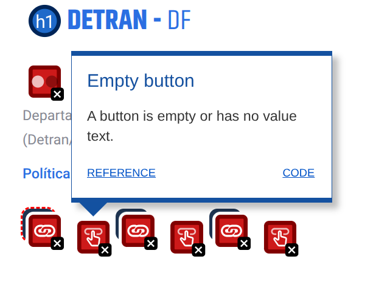
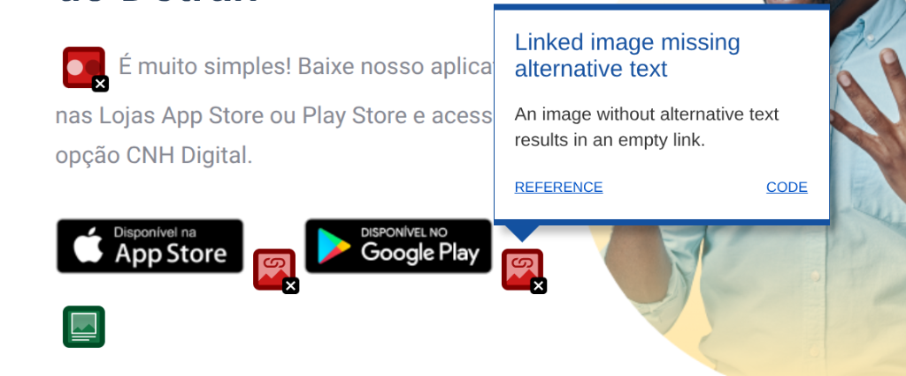
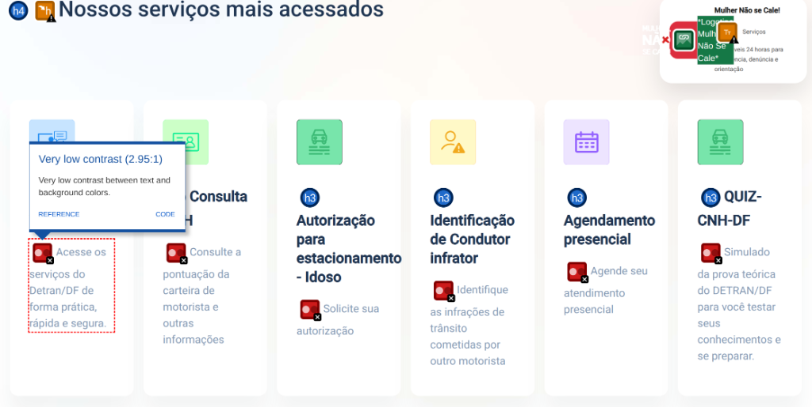
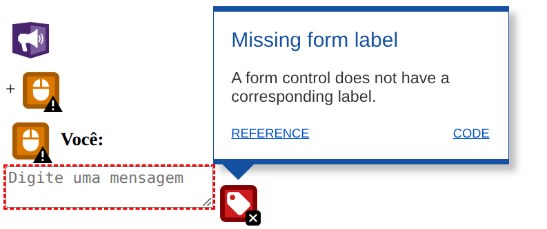
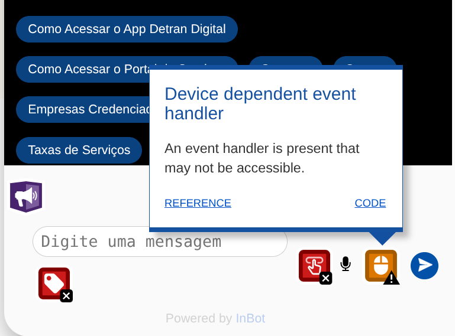
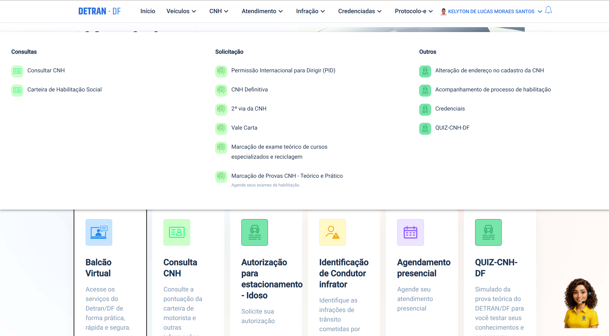
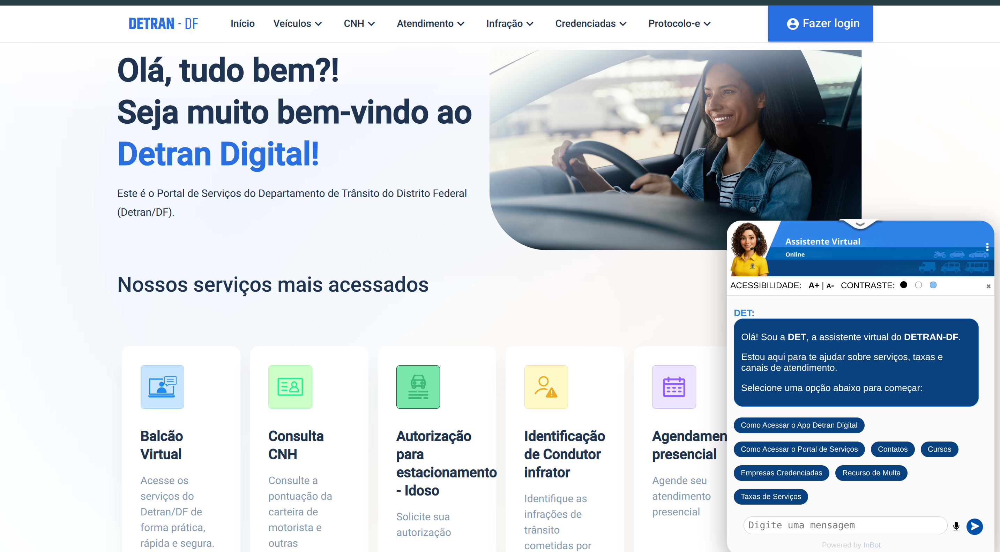

# Relatório de Avaliação: Portal DETRAN-DF

> **Objeto de Estudo:** Portal principal do Departamento de Trânsito do Distrito Federal (DETRAN-DF)  
> **URL:** [https://portal.detran.df.gov.br/#/home](https://portal.detran.df.gov.br/#/home)

---

!!! info "Como ler esta avaliação"
Este documento funciona como o **Relatório Técnico de Avaliação de IHC**, integrando o detalhamento técnico da inspeção de acessibilidade/usabilidade, a análise comportamental baseada em personas, a simulação por roteiro de tarefas e os **resultados empíricos (métricas de tempo e sucesso)** de testes de usabilidade com usuários reais. Para visualizar a planilha completa com todos os 99 critérios de acessibilidade testados, acesse a nossa [Matriz de Conformidade (Checklist)](checklistDetran.md).

---

## 1. Introdução

Este documento apresenta a avaliação de Interação Humano-Computador (IHC) e Acessibilidade Digital realizada no portal principal do Departamento de Trânsito do Distrito Federal (DETRAN-DF). O objetivo desta auditoria é analisar a facilidade de uso e a conformidade do canal oficial do órgão com os principais referenciais normativos, garantindo o direito constitucional de acesso à informação e a autonomia do cidadão.

A avaliação adotou uma **abordagem híbrida de IHC**, combinando:

1. **Método Analítico (Inspeção):** Auditoria técnica balizada pelas diretrizes internacionais _Web Content Accessibility Guidelines (WCAG 2.2)_, pela norma nacional _ABNT NBR 17225_, pelo _Guia de Boas Práticas para Acessibilidade Digital_ do Governo Federal e pelas _10 Heurísticas de Nielsen_, guiada por simulações cognitivas de uma Persona.
2. **Método Empírico (Observação):** Testes de usabilidade com usuário real, executando cenários de tarefas práticos para coletar métricas de desempenho (tempo de execução e taxa de sucesso).

---

## 2. Perfil dos Avaliadores

A avaliação foi realizada por uma equipe de estudantes de Engenharia de Software da Universidade de Brasília (UnB), no âmbito da disciplina de Interação Humano-Computador (IHC). A inspeção foi conduzida utilizando critérios de acessibilidade digital, princípios de usabilidade e métodos de avaliação heurística reconhecidos na literatura.

---

## 3. Metodologia de Avaliação

A avaliação foi realizada de forma remota no ambiente de produção do portal, utilizando uma metodologia híbrida de IHC:

- **Inspeção Automática (Analítica):** Emprego da ferramenta WAVE (_Web Accessibility Evaluation Tool_) para mapeamento de erros de código, semântica e contrastes.
- **Inspeção Manual/Heurística (Analítica):** Simulação de navegação exclusiva via teclado para validação de foco, varredura de quebra de layout por ampliação de tela (zoom de até 400%) e análise de consistência de fluxo.
- **Simulação Cognitiva com Persona (Analítica):** Uso de uma persona representativa do público-alvo para perpassar roteiros de tarefas específicas e avaliar o impacto prático das barreiras encontradas sob a ótica de um cidadão de baixa afinidade digital.
- **Teste de Usabilidade com Usuários (Empírica):** Observação de usuário real do portal executando tarefas em cenários planejados, coletando métricas de tempo médio de execução e taxas de conclusão.

### 3.2 Limitação das ferramentas utilizadas

Durante a inspeção, buscou-se utilizar também a ferramenta _axe DevTools_ como apoio à avaliação automática de acessibilidade. Entretanto, a extensão não conseguiu realizar a análise do Portal do DETRAN-DF, exibindo uma mensagem de impossibilidade de inspeção da página. Dessa forma, optou-se pela utilização do WAVE como ferramenta principal de auditoria automática, complementada por inspeção manual baseada nas diretrizes WCAG 2.2 e nas heurísticas de Nielsen.

_Figura 1 – Mensagem apresentada pelo axe DevTools ao tentar analisar o portal do DETRAN-DF._

### 3.3 Planejamento de Cenários e Roteiro de Tarefas (Percurso Cognitivo)

Com o propósito de estruturar a simulação baseada na persona e orientar nossa análise sobre a usabilidade da plataforma, delineamos contextos hipotéticos de tarefas reais (roteiros de tarefas). Cada cenário está estruturado para avaliar a facilidade com que o usuário alcança o seu objetivo, a clareza das opções e o feedback do sistema:

| Tarefa / Cenário                                                 | Objetivo da Avaliação (Percurso Cognitivo)                                                                                    |
| ---------------------------------------------------------------- | ----------------------------------------------------------------------------------------------------------------------------- |
| **Cenário 1:** Notificação de infração e verificação de débitos. | Analisar a fluidez na navegação até a seção de débitos do veículo e a transparência na exposição de prazos e valores.         |
| **Cenário 2:** Emissão da certidão “nada consta” da CNH.         | Avaliar o procedimento de emissão de certidões e a eficácia das opções de visualização e download de arquivos oficiais.       |
| **Cenário 3:** Consulta de exames agendados.                     | Validar se o usuário encontra de forma intuitiva as informações sobre a agenda de testes práticos ou teóricos.                |
| **Cenário 4:** Pesquisa de escolas de condução próximas.         | Medir a eficácia dos mecanismos de pesquisa de Centros de Formação de Condutores (CFC) e a utilidade dos filtros geográficos. |

Esta simulação cognitiva foca em verificar a correspondência entre a expectativa do usuário ao realizar uma ação e a resposta oferecida pela interface do portal.

---

## 4. Persona de Referência

Para guiar a avaliação de usabilidade sob o prisma das necessidades reais dos cidadãos, foi empregada a simulação de tarefas baseada em uma persona. Esta metodologia auxilia na identificação de barreiras práticas na experiência de uso.

A persona adotada para este estudo é **Carlos Alberto Ferreira**, um técnico em manutenção predial de 56 anos com afinidade tecnológica média-baixa. A análise técnico-comportamental e o impacto das não conformidades identificadas no portal do DETRAN-DF foram mapeados diretamente em relação às suas necessidades específicas de leitura, contraste, clareza visual e facilidade de navegação.

Para visualizar o perfil completo da persona, incluindo seus objetivos, comportamentos e principais frustrações, consulte a página dedicada:

- 👉 [Persona de Referência: Carlos Alberto Ferreira](persona.md)

---

## 5. Resultados da Avaliação

Os problemas identificados no portal do DETRAN-DF foram avaliados e classificados de acordo com a **escala de gravidade clássica de Jakob Nielsen (1994)**. Essa escala permite priorizar as correções com base no impacto da falha sobre a tarefa do usuário:

*   **0 (Não é um problema):** Não interfere na usabilidade ou acessibilidade.
*   **1 (Cosmético):** Não precisa ser corrigido urgentemente; causa apenas incômodo estético.
*   **2 (Problema Leve / Barreira Menor):** Causa hesitação ou lentidão, mas o usuário consegue concluir a tarefa.
*   **3 (Problema Grave / Barreira Significativa):** Dificulta severamente a experiência ou leitura, com alto risco de o usuário desistir.
*   **4 (Catástrofe de Usabilidade / Barreira Impeditiva):** Impede totalmente a conclusão da tarefa ou bloqueia/exclui o acesso de um grupo de usuários.

---

### 5.1 Não Conformidade - Elementos de Interface sem Texto Alternativo ou Vazios

> **Mapeamento na Matriz de Conformidade:** [Não Conforme (❌) — Critério 1 e Critério 31](checklistDetran.md#conteudo-nao-textual)

A ferramenta WAVE identificou falhas graves de conteúdo não-textual, incluindo imagens vinculadas a links sem texto alternativo descritivo (_Missing alternative text_ e _Linked image missing alternative text_), além de botões e links totalmente vazios (_Empty button_ e _Empty link_).

_Figura 2 – Painel de erros do WAVE evidenciando a recorrência de falhas no conteúdo não-textual e de componentes vazios._

_Figura 3 – Erros do WAVE evidenciando empty button missing e empty link missing_

_Figura 4 – Erros do WAVE evidenciando empty alternative text image_

- **Análise Técnico-Comportamental:** Durante os testes manuais práticos, constatou-se que, sob a perspectiva de um usuário que utiliza o mouse, os botões e links secundários de serviços funcionam perfeitamente para disparar suas respectivas ações. Contudo, a auditoria automatizada acusa corretamente a existência de "elementos vazios" porque as tags de código correspondentes carecem por completo de textos internos reais ou de atributos de acessibilidade como `aria-label`. Visualmente, os botões exibem apenas imagens ou ícones ilustrativos, o que atende à usabilidade tradicional com mouse, mas falha na arquitetura técnica de acessibilidade. Sem uma descrição programática associada, os leitores de tela não conseguem identificar o propósito do link, anunciando apenas as palavras genéricas "botão" ou "link" para usuários cegos.
- **Critério Violado:** WCAG 2.2 / ABNT NBR 17225: Critério de Sucesso 1.1.1 (Conteúdo Não-Textual - Nível A) e Critério de Sucesso 4.1.2 (Nome, Função, Valor - Nível A)
- **Guia do Gov.br:** Seção de Imagens e Componentes Semânticos Nativos.
- **Heurística de Nielsen Violada:** Visibilidade do Status do Sistema / Flexibilidade e Eficiência de Uso.
- **Gravidade:** 4 (Catástrofe de Usabilidade / Barreira Impeditiva) — Impede totalmente que usuários de leitores de tela compreendam o propósito de botões e links de navegação.
- **Sugestão de Correção:** Adicionar atributos `alt` descritivos em todas as imagens informativas e garantir que os botões e links possuam textos internos descritivos ou atributos `aria-label` explicitando sua função para tecnologias assistivas.

---

### 5.2 Não Conformidade - Contraste de Texto Insuficiente

> **Mapeamento na Matriz de Conformidade:** [Não Conforme (❌) — Critério 49 e Critério 53](checklistDetran.md#contraste-e-texto)

Foram mapeados 39 pontos de baixíssimo contraste (_Very low contrast_) distribuídos pela interface, afetando menus superiores (Início, Veículos, CNH, Atendimento, Infração) e textos secundários do portal. A proporção de cor entre o texto e o fundo não atinge o limite mínimo exigido para legibilidade confortável.

_Figura 5 – Erros do WAVE evidenciando baixo contraste_

- **Critério Violado:** WCAG 2.2 / ABNT NBR 17225: Critério de Sucesso 1.4.3 (Contraste Mínimo - Nível AA).
- **Guia do Gov.br:** Diretrizes de Identidade Visual e Legibilidade de Cores.
- **Heurística de Nielsen Violada:** Estética e Design Minimalista.
- **Gravidade:** 3 (Problema Grave / Barreira Significativa) — Prejudica severamente a legibilidade de textos por usuários com baixa visão ou em ambientes com reflexo de luz.
- **Impacto na Persona:** Carlos relata explicitamente a necessidade de "fonte em tamanho confortável e com bom contraste" devido à dificuldade de leitura de "textos pequenos". O baixíssimo contraste identificado nos menus afeta diretamente sua capacidade de localizar opções de navegação.
- **Sugestão de Correção:** Modificar os valores hexadecimais no arquivo de estilos CSS para paletas de cores mais escuras no texto em primeiro plano, forçando uma proporção de contraste mínima de 4,5:1.

---

### 5.3 Não Conformidade - Ausência de Rótulos Permanentes em Formulários

> **Mapeamento na Matriz de Conformidade:** [Não Conforme (❌) — Critério 38](checklistDetran.md#assistencia-de-entrada)

Existem campos de entrada de dados, como mecanismos de busca, que carecem de rótulos (labels) associados.

_Figura 6 – Erros do WAVE evidenciando label missing_

- **Critério Violado:** WCAG 2.2 / ABNT NBR 17225: Critério de Sucesso 3.3.2 (Rótulos ou Instruções - Nível A).
- **Guia do Gov.br:** Seção de Formulários e Acessibilidade de Entrada de Dados.
- **Heurística de Nielsen Violada:** Prevenção de Erros / Reconhecimento em vez de Recordação.
- **Gravidade:** 2 (Problema Leve / Barreira Menor) — Dificulta a identificação rápida do propósito dos campos, gerando insegurança ou preenchimento incorreto.
- **Impacto na Persona:** Carlos evita "explorar menus desconhecidos por medo de cometer algum erro" e relata insegurança diante de "formulários extensos". Um campo de busca sem rótulo claro reforça essa insegurança, pois ele não consegue confirmar visualmente o propósito do campo antes de interagir.
- **Sugestão de Correção:** Implementar o uso explícito da tag HTML `<label>` programaticamente vinculada através do atributo `for` ao respectivo ID do campo de texto, garantindo que leitores de tela identifiquem o propósito do campo de forma inequívoca.

---

### 5.4 Não Conformidade - Quebra na Hierarquia Semântica de Títulos

> **Mapeamento na Matriz de Conformidade:** [Não Conforme (❌) — Critério 8](checklistDetran.md#adaptavel)

A análise estrutural do WAVE expôs que o portal pula níveis lógicos na organização de seus cabeçalhos (_Skipped heading level_). O site transita de forma direta de um título principal `<h1>` para subtítulos de nível `<h4>` (como nos títulos "Veículos", "Habilitação", "Agendamento" e "Infração" do rodapé) sem passar sequencialmente pelos níveis `<h2>` ou `<h3>`.

- **Critério Violado:** WCAG 2.2 / ABNT NBR 17225: Critério de Sucesso 1.3.1 (Informações e Relações - Nível A) e Critério de Sucesso 2.4.10 (Cabeçalhos de Seção - Nível AAA).
- **Guia do Gov.br:** Estruturação Lógica de Páginas e Navegabilidade.
- **Heurística de Nielsen Violada:** Consistência e Padrões.
- **Gravidade:** 2 (Problema Leve / Barreira Menor) — Desorienta a leitura estruturada por leitores de tela, mas sem impedir totalmente o consumo do conteúdo.
- **Sugestão de Correção:** Reestruturar semanticamente as tags do documento HTML, definindo uma árvore lógica coerente onde as seções principais abaixo do `<h1>` sejam marcadas obrigatoriamente como `<h2>`, seguidas por seus respectivos subitens como `<h3>` e `<h4>`.

---

### 5.5 Não Conformidade - Dependência de Manipuladores de Eventos Vinculados ao Mouse

> **Mapeamento na Matriz de Conformidade:** [Não Conforme (❌) — Critério 13 e Critério 14](checklistDetran.md#acessivel-por-teclado)

Foram encontrados 23 pontos críticos no código em que ações e interações cruciais dependem estritamente de interações físicas atreladas a um ponteiro de mouse (_Device dependent event handler_). Elementos de navegação e botões utilizam gatilhos puramente lógicos de ponteiro sem fornecer equivalência em comandos de teclado.

_Figura 7 – Erros do WAVE evidenciando a dependência de dispositivo ponteiro no chatbot._

- **Critério Violado:** WCAG 2.2 / ABNT NBR 17225: Critério de Sucesso 2.1.1 (Teclado - Nível A).
- **Guia do Gov.br:** Princípios de Independência de Dispositivo de Entrada.
- **Heurística de Nielsen Violada:** Flexibilidade e Eficiência de Uso / Controle e Liberdade do Usuário.
- **Gravidade:** 4 (Catástrofe de Usabilidade / Barreira Impeditiva) — Exclui completamente a possibilidade de uso por pessoas com limitações motoras que dependem apenas de teclado.
- **Sugestão de Correção:** Configurar os scripts JavaScript de modo que, para cada manipulador de evento baseado em ponteiro (como `onmouseover` ou `onclick`), exista um manipulador de evento de teclado redundante correspondente (como `onfocus` ou `onkeydown`).

---

### 5.6 Não Conformidade - Falha de Gerenciamento de Foco em Menus Suspensos

> **Mapeamento na Matriz de Conformidade:** [Não Conforme (❌) — Critério 15, Critério 27 e Critério 55](checklistDetran.md#acessivel-por-teclado)

Durante a validação manual de navegabilidade, observou-se que os itens do menu superior (como "Veículos", "CNH", "Atendimento" e "Infração") podem receber foco por meio da tecla `Tab`. Ao receberem foco, os respectivos submenus são exibidos visualmente na interface.

Entretanto, ao continuar a navegação pelo teclado, o foco não percorre as opções internas desses submenus, sendo direcionado para outros elementos da página. Como consequência, a navegação pela barra principal torna-se inconsistente para usuários que dependem exclusivamente do teclado, dificultando o acesso rápido e direto aos serviços organizados nos menus suspensos.

_Figura 8 – Evidência visual da quebra na ordem de foco por teclado no menu expandido._

- **Evidência do Teste Manual (Validação Prática):** Durante a inspeção heurística, verificou-se que o foco alcança os itens principais da barra de navegação superior, porém não é transferido para os links contidos nos submenus expandidos. Tentativas de interação utilizando as teclas `Tab`, `Enter` e `Espaço` não permitiram acessar as opções internas. Em alguns casos, a tecla `Espaço` provocou apenas a rolagem da página (_page scroll_), indicando que os componentes não foram implementados com suporte adequado à navegação por teclado e tecnologias assistivas.
- **Critério Violado:** WCAG 2.2 / ABNT NBR 17225: Critério de Sucesso 2.1.1 (Teclado – Nível A) e Critério de Sucesso 2.4.3 (Ordem do Foco – Nível A).
- **Guia do Gov.br:** Seção de Menus de Navegação e Componentes Complexos.
- **Heurística de Nielsen Violada:** Flexibilidade e Eficiência de Uso / Consistência e Padrões.
- **Gravidade:** 4 (Catástrofe de Usabilidade / Barreira Impeditiva) — Impede que usuários de teclado ou leitores de tela alcancem e executem serviços internos desses menus.
- **Sugestão de Correção:** Implementar o padrão de menus acessíveis recomendado pela WAI-ARIA, garantindo que os links internos dos submenus sejam incluídos na sequência de foco do teclado. Após a abertura do menu, o usuário deve conseguir navegar pelas opções internas utilizando `Tab` ou, alternativamente, as teclas direcionais (`↑` e `↓`), conforme os padrões de acessibilidade para componentes de navegação.

---

### 5.7 Não Conformidade - Obstrução de Conteúdo por Elementos Flutuantes em Zoom de 400%

> **Mapeamento na Matriz de Conformidade:** [Não Conforme (❌) — Critério 52 e Critério 59](checklistDetran.md#refluxo-e-espacamento)

Ao realizar o teste manual de ampliação de tela simulando a necessidade de usuários com baixa visão (zoom de até 400%), constatou-se que o portal aciona layouts responsivos similares a visualizações em dispositivos móveis. Contudo, elementos flutuantes fixos na interface — especificamente o widget do chatbot de atendimento e o card promocional lateral "Mulher Não se Cale!" — não acompanham o refluxo correto da página. Esses componentes se sobrepõem diretamente ao texto institucional e aos blocos de títulos principais, gerando oclusão e impedindo a leitura do conteúdo central.

- **Critério Violado:** WCAG 2.2 / ABNT NBR 17225: Critério de Sucesso 1.4.10 (Refluxo - Nível AA) e Critério de Sucesso 2.4.11 (Foco Não Oculto - Nível AA).
- **Guia do Gov.br:** Diretrizes de Responsividade e Flexibilidade de Layout.
- **Heurística de Nielsen Violada:** Estética e Design Minimalista / Flexibilidade e Eficiência de Uso.
- **Gravidade:** 3 (Problema Grave / Barreira Significativa) — Causa oclusão visual de textos e títulos principais, impedindo a leitura contínua quando o zoom está ativo.
- **Impacto na Persona:** Como Carlos "prefere acessar o portal pelo computador" e pode eventualmente precisar ampliar a tela por dificuldade visual relacionada à idade (56 anos), a obstrução de conteúdo por elementos flutuantes em zoom alto representa uma barreira direta às suas necessidades relatadas de "fonte em tamanho confortável".
- **Sugestão de Correção:** Configurar regras de mídia CSS (_Media Queries_) específicas para que elementos flutuantes e sobreposições decorativas ou de suporte (como chatbots e banners fixos) sejam movidos para o fluxo regular do rodapé ou fiquem ocultos de forma controlada quando a viewport atingir larguras equivalentes ao zoom de 400%, liberando a área de leitura principal.

---

### 5.8 Não Conformidade - Recursos de Acessibilidade Restrito ao Chatbot

> **Mapeamento na Matriz de Conformidade:** [Parcialmente Conforme (⚠️) — Critério 50 e Critério 94](checklistDetran.md#contraste-e-texto)

Durante a inspeção manual observou-se que o portal disponibiliza controles de acessibilidade, como ajuste de contraste e tamanho da fonte, apenas na interface do assistente virtual (chatbot). Entretanto, essas configurações produzem efeito exclusivamente sobre o próprio chatbot, não sendo aplicadas ao restante da interface do portal.

_Figura 9 – Controles de contraste e tamanho da fonte disponíveis apenas no chatbot._

- **Impacto na Persona:** Considerando a persona Carlos Alberto Ferreira, de 56 anos e com dificuldades de leitura, a existência desses controles apenas no chatbot não contribui para facilitar a navegação pelo portal, já que as informações e serviços consultados permanecem com o mesmo tamanho de fonte e contraste.
- **Gravidade:** 2 (Problema Leve / Barreira Menor) — Limita a utilidade do recurso global de acessibilidade, embora o usuário possa contornar usando o zoom nativo do navegador.
- **Sugestão de Correção:** Implementar os controles de contraste e ajuste de fonte de forma global, garantindo que suas alterações sejam refletidas em todas as páginas e componentes do portal, e não apenas na interface do chatbot.

---

### 5.9 Métricas de Usabilidade (Teste Empírico com Usuários)

Com o propósito de complementar a inspeção analítica e fundamentar a nossa análise em testes reais, o grupo 5 conduziu testes empíricos de usabilidade com usuários reais da plataforma. A partir da execução dos 4 cenários propostos (ver seção 3.3), consolidamos as seguintes métricas de usabilidade:

#### Taxa de Sucesso das Tarefas

- **Conclusão Integral:** **50%** das tarefas foram concluídas com sucesso total e sem suporte (destacando-se os cenários **Cenário 2** - Emissão de Nada Consta, e **Cenário 4** - Pesquisa de CFCs).
- **Conclusão Parcial/Incompleta:** **50%** das tarefas apresentaram conclusões parciais ou foram interrompidas por barreiras severas (destacando-se os cenários **Cenário 1** - Verificação de Débitos e Infrações, e **Cenário 3** - Consulta de Exames Agendados).

#### Tempo Médio de Execução

- **Média geral por tarefa:** 1 minuto e 10 segundos.
- **Tarefa mais rápida:** Cenário 4 (Pesquisa de Escolas de Condução), com média de conclusão de apenas **8 segundos** (visto que o mapa e os filtros geográficos respondem de forma ágil quando localizados).
- **Tarefa mais lenta/crítica:** Cenário 1 (Verificação de débitos de veículos), com média registrada de **3 minutos e 30 segundos** devido à complexidade da estrutura de navegação e à falta de feedback do sistema para a necessidade de login prévio.

---

## 6. Conclusão

A avaliação de Interface Humano-Computador (IHC) e acessibilidade digital realizada no Portal do DETRAN-DF Digital aponta para um cenário de maturidade insatisfatória no que diz respeito à inclusão digital e à facilidade de uso geral. Embora o portal consolide os principais serviços procurados pelo cidadão em formato digital, as falhas técnicas encontradas agem como severas barreiras de exclusão.

Os erros estruturais, de contraste e de responsividade apontados pela auditoria técnica demonstram que princípios básicos do Desenho Universal não foram devidamente priorizados durante a arquitetura do software. A dependência excessiva de scripts baseados em interações com o mouse, os saltos inadequados na hierarquia de cabeçalhos e a obstrução física de áreas de texto durante a ampliação de tela (refluxo) penalizam diretamente o público que mais depende do auxílio do Estado: pessoas com deficiência visual (cegas ou de baixa visão), idosos e indivíduos com limitações motoras.

Sob a ótica da persona de referência utilizada nesta avaliação, Carlos Alberto Ferreira, 56 anos, com afinidade tecnológica médio-baixa, as não conformidades identificadas deixam de ser apenas violações técnicas e passam a representar barreiras concretas à sua autonomia digital. O baixo contraste textual e a ausência de rótulos perenes em formulários atingem diretamente as fragilidades relatadas pela persona (dificuldade de leitura de textos pequenos e o medo de "cometer algum erro" ao interagir com campos pouco claros). Da mesma forma, a obstrução de conteúdo por elementos flutuantes durante a ampliação de tela compromete justamente a estratégia de compensação que um usuário como Carlos adotaria ao enfrentar dificuldades visuais relacionadas à idade. Esses achados confirmam que as barreiras do portal não afetam exclusivamente usuários de tecnologias assistivas especializadas, mas também o cidadão comum com baixo letramento digital, ampliando o alcance e a urgência das correções propostas.

Do ponto de vista de usabilidade pura, as heurísticas de Estética e Design Minimalista, Consistência e Prevenção de Erros são frequentemente violadas por textos apagados e formulários sem descrições perenes. Conclui-se, portanto, que para se adequar plenamente à legislação nacional e às exigências técnicas vigentes, o Portal do DETRAN-DF Digital necessita de uma reformulação em suas folhas de estilo e em sua codificação semântica estrutural, assegurando uma experiência autônoma, digna e acessível a toda a população.

---

## 7. Referências Bibliográficas

- **ASSOCIAÇÃO BRASILEIRA DE NORMAS TÉCNICAS.** _ABNT NBR 17225: Acessibilidade digital — Requisitos de acessibilidade para conteúdo na Web_. Rio de Janeiro: ABNT, 2024.
- **BRASIL.** _Guia de Boas Práticas para Acessibilidade Digital_. Programa de Cooperação Reino Unido-Brasil em Acesso Digital, NIC.br, Governo Federal (gov.br), 2022.
- **NIELSEN, Jakob.** _10 Usability Heuristics for User Interface Design_. Nielsen Norman Group, 1994.
- **WORLD WIDE WEB CONSORTIUM (W3C).** _Web Content Accessibility Guidelines (WCAG) 2.2_. W3C Recommendation, 2023.
