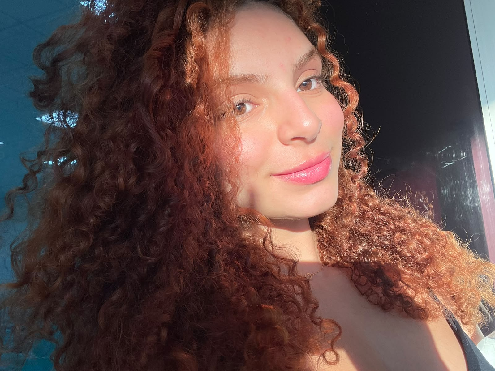
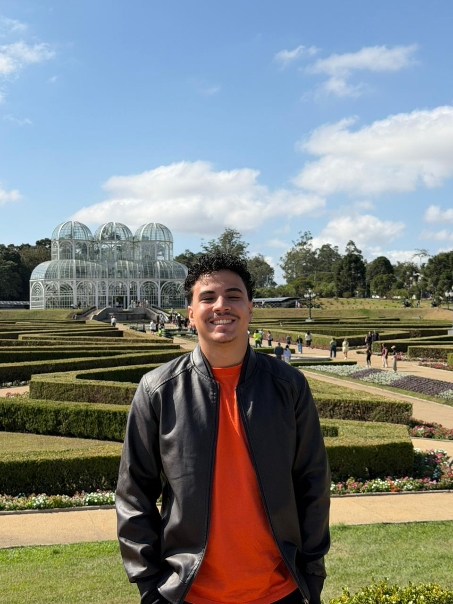
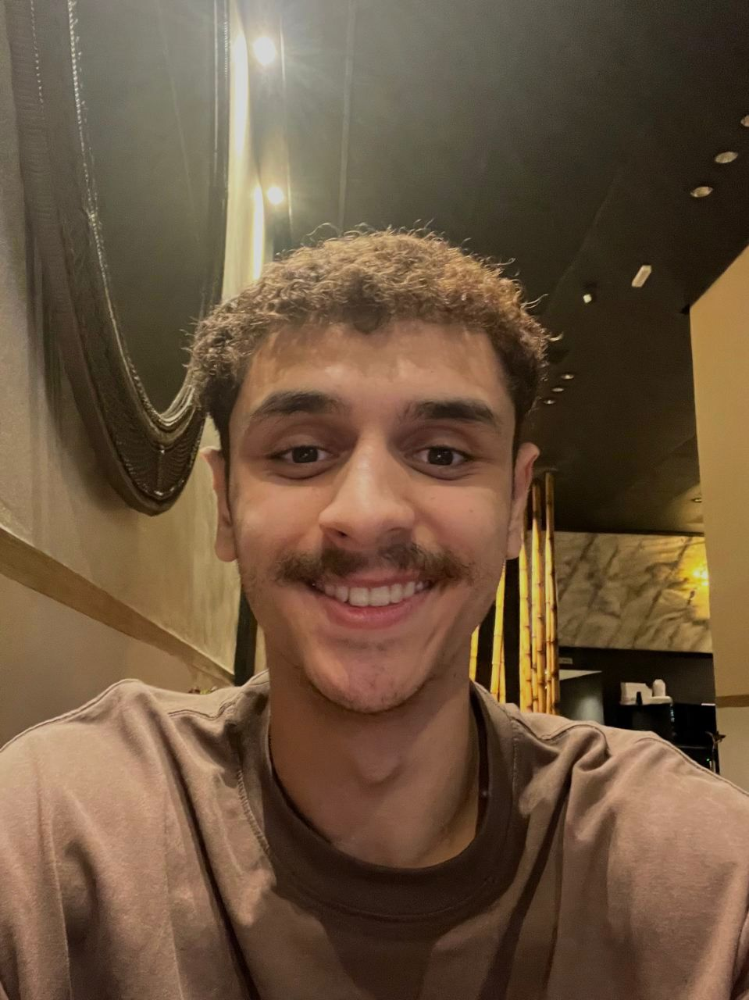
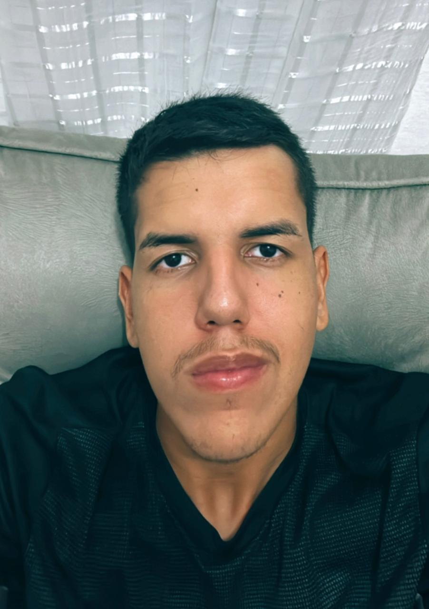

# VerificAAA — Guia de Acessibilidade (V3)

> **Grupo 05 — IHC/UnB (2026.1)**  
> Esta é a **Versão 3** do nosso *Guia de Acessibilidade*, evoluída a partir do projeto desenvolvido pelo Grupo 05 no semestre 2025.2. O guia está alinhado às diretrizes **WCAG 2.2 (AA)**, **ABNT NBR 17225:2025 (Web)** e **ABNT NBR 17060:2022 (Mobile)**, além de incluir a avaliação prática baseada em IHC e acessibilidade do portal do **DETRAN-DF**.

---

## Sobre o projeto

Somos o **Grupo 05** da disciplina **Interação Humano-Computador (IHC)** na Universidade de Brasília (UnB), semestre 2026.1.  
Nosso objetivo é expandir o trabalho anterior e oferecer **checklists práticos**, **guias de consulta rápida** e a **avaliação técnica de caso real** que auxiliem equipes (design, desenvolvimento, QA, criação de conteúdo e gestão de projeto) a planejar e construir produtos verdadeiramente acessíveis e usáveis.

---

## O que há de novo na V3
*   **Avaliação do Portal DETRAN-DF:** Incorporação de uma auditoria técnica de usabilidade e acessibilidade de caso real.
*   **Checklist de Caso Real:** Um checklist de critérios normativos (A, AA, AAA) detalhado com achados e sugestões de correções específicas.
*   **Guia de Site Acessível:** Uma seção de fácil consulta para entender o que um site precisa para ser acessível de forma simplificada.
*   **Alinhamento Teórico WCAG:** Explicação facilitada dos princípios P.O.U.R.

---

## Equipe (2026.1)

Abaixo estão listados os integrantes do grupo que participaram do desenvolvimento desta versão:

	<figure class="team-card">
		
		<figcaption>
			<strong>Gabriela Dourado</strong> 
			231026821
		</figcaption>
	</figure>

	<figure class="team-card">
		
		<figcaption>
			<strong>Jorge Henrique Lessa</strong> 
			231011570
		</figcaption>
	</figure>

	<figure class="team-card">
		
		<figcaption>
			<strong>Kelyton de Lucas Moraes</strong> 
			241012033
		</figcaption>
	</figure>

	<figure class="team-card">
		
		<figcaption>
			<strong>Luiz Henrique Guimarães</strong> 
			222022144
		</figcaption>
	</figure>

	<figure class="team-card">
		
		<figcaption>
			<strong>Matheus Ribeiro</strong> 
			231011749
		</figcaption>
	</figure>

	<figure class="team-card">
		
		<figcaption>
			<strong>Natan França</strong> 
			241011537
		</figcaption>
	</figure>

	<figure class="team-card">
		
		<figcaption>
		<figcaption>
			<strong>Pedro Henrique Gomes</strong> 
			232030041
		</figcaption>
	</figure>

---

## Créditos e referências ao trabalho anterior

Esta V3 baseia-se e expande o trabalho da V2 (semestre 2025.2), cujos autores originais foram:
*   Ana Elisa, Marina Galdi, Davi Camilo, Euller Junior e Kauã Vale.

---

## Nota de conformidade
*   **Objetivo principal:** WCAG 2.2 nível AA.
*   **Adoção nacional:** NBR 17225 (Web) e NBR 17060 (Mobile).
